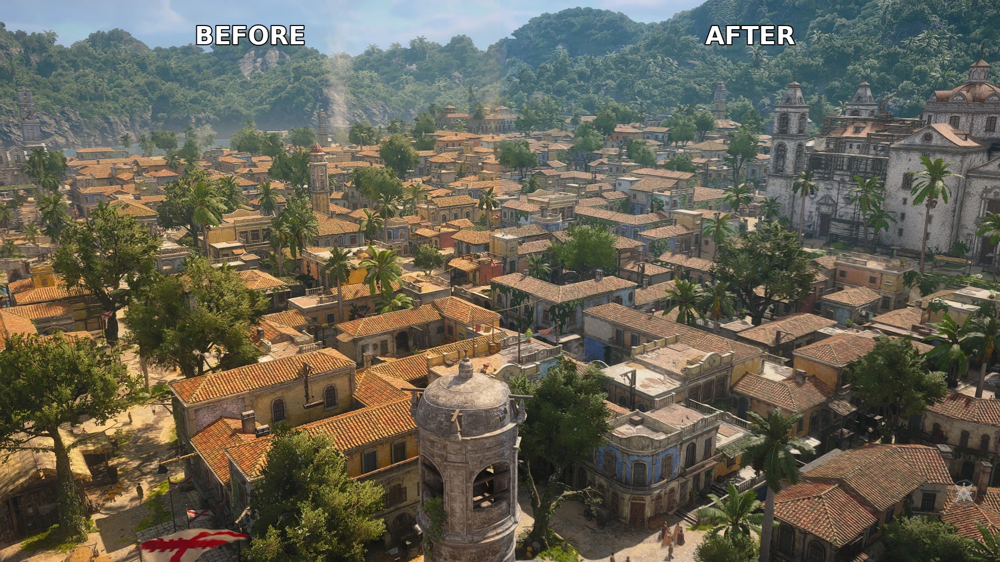
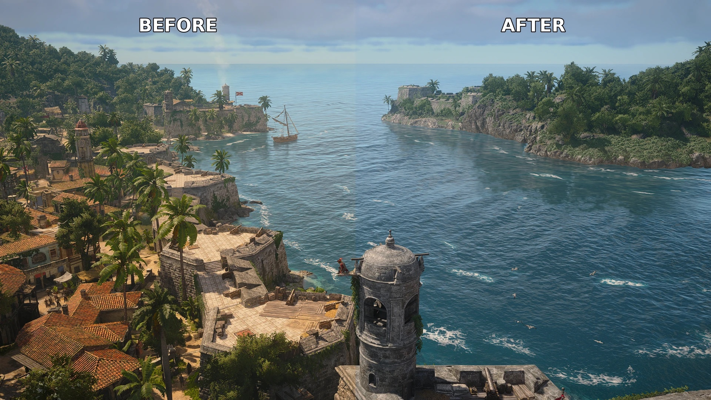
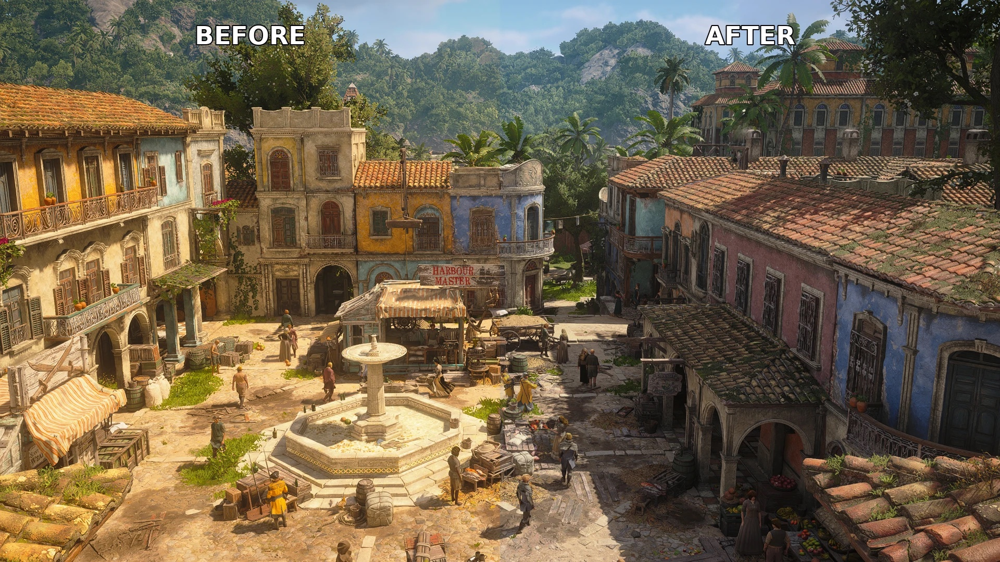
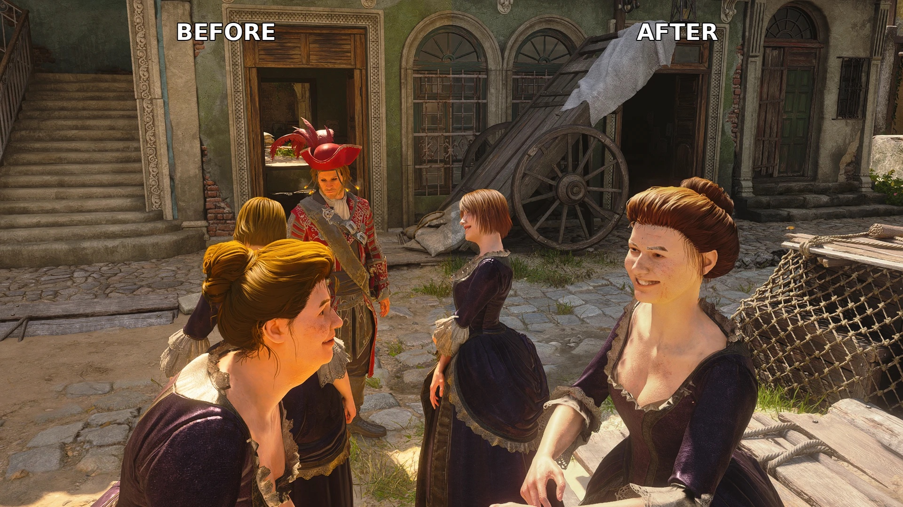
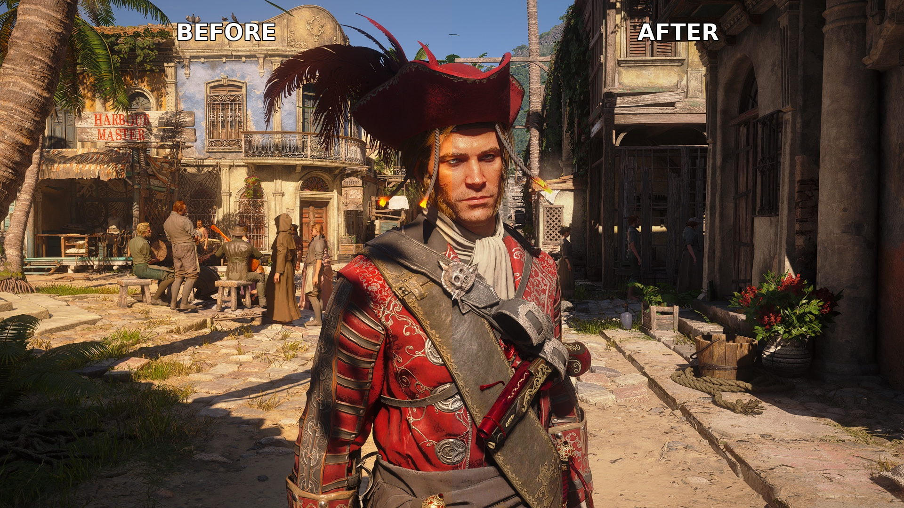
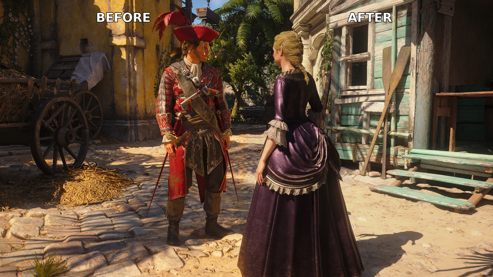

# 🎮 Orange Begone – AC4 Black Flag ReShade Preset

**Tired of that overwhelming orange cast?** This ReShade preset does one thing and does it beautifully: **removes the baked-in orange/yellow filter** and reveals a clean, neutral image underneath.

> No stylized filters. No "cinematic" gimmicks. Just the orange gone. ✨

---

## What You Get

✅ **Smart color grading** – uses a single selective pass instead of blunt global adjustments  
✅ **Obvious difference** – toggle ReShade on/off and see the transformation instantly  
✅ **Lightweight** – negligible performance cost even on mid-range GPUs  
✅ **Verified precision** – every parameter is checked against actual shader sources  

---

## 📸 Before & After

Each shot is split down the middle — **left is vanilla** (the orange cast), **right is the preset**.

**Havana rooftops**


**Harbor & open water**


**Town square**


**Character faces & skin tones**


---

## 🛠 How It Works

The preset uses **4 passes** working in sequence:

```
SMAA  →  Deband  →  Lightroom  →  CAS
```

### 1️⃣ **Cleanup Stage**

**SMAA** *(Morphological Anti-Aliasing)*
- Smooths jagged edges before sharpening makes them worse
- Edge detection: luma-based (no depth buffer needed)
- Settings: threshold `0.10`, 32 search steps

**Deband**
- Removes color banding in smooth gradients (skies, ocean, water)
- Runs at default thresholds with one pass
- Visually invisible—only shows up where banding would have appeared

### 2️⃣ **Color Grade** (qUINT Lightroom)

This is where the magic happens. A single selective color-grading pass replaces multiple competing filters:

**How the orange/yellow gets removed:**
- **Cooler white balance** – shifts the whole frame slightly toward blue to neutralize the warm cast
- **Orange & yellow pulled back** – reduces saturation so skin, sand, and stone look natural instead of golden
- **Hue nudges** – yellows shift toward green (so blondes stay blonde), oranges shift toward red (so skin looks natural)
- **Smart saturation** – greens and blues stay vibrant so foliage and skies look fresh and clean
- **Tone adjustments** – highlights are controlled so bright surfaces don't blow out, shadows stay visible
- **Vibrance** – lifts muted colors without oversaturating everything

💡 **Result:** Edward looks like Edward, the Caribbean looks tropical, and nothing looks filtered.

### 3️⃣ **Sharpening** (CAS)

**CAS** *(Contrast Adaptive Sharpening by AMD)*
- Sharpens soft details on faces and sails
- Backs off where contrast is already high (no halos or weird artifacts)
- Crisp detail at `0.30` intensity without that "over-sharpened" look

---

## ⚡ Performance

| Metric | Details |
|--------|---------|
| **Resolution** | Tested at 1080p+ |
| **GPU** | NVIDIA RTX 5070 Ti (tested) |
| **CPU** | AMD Ryzen 7 7800X3D (tested) |
| **RAM** | 32 GB (tested) |
| **Impact** | Very low – all passes are lightweight screen-space effects (no ray marching). Cost scales with resolution, so expect a bit more at 4K than at 1080p |

---

## 🖥 Compatibility

**Designed for SDR** – AC4 Black Flag outputs a standard 8-bit sRGB image, and every value in this preset (white balance, saturation, tone curves) is tuned for that. If you force HDR on top of the game via **Windows Auto HDR**, **NVIDIA RTX HDR**, or **Special K**, turn it off before using this preset — otherwise the grade will look wrong (shifted colors, crushed or blown highlights). The shaders aren't HDR-aware.

---

## 🚀 Installation

### Step 1: Install ReShade
1. Download **ReShade 6.7.3** from [reshade.me](https://reshade.me/)
2. Run the installer and point it at your game executable (the one you actually launch to play)
3. Let it auto-detect your rendering API

### Step 2: Install Effect Packages
When the installer asks which effects to install, **check these three:**
- **Standard effects** → provides `Deband`
- **SweetFX by CeeJay.dk** → provides `SMAA` and `CAS`
- **qUINT by Marty McFly** → provides `Lightroom`

### Step 3: Load the Preset
1. Launch the game
2. Press **Home** to open the ReShade overlay
3. Click the preset browser at the top and browse for `AC4BF_OrangeBegone.ini`
4. All four effects enable automatically in the correct order ✓

---

## 🎛 Recommended Game & Driver Settings

The preset works out of the box, but a few settings help it look its best — especially if you use modern upscaling/AA.

### If you use DLAA, DLSS, or in-game TAA
These already anti-alias the frame *before* ReShade sees it, so the preset's **SMAA pass is redundant** and can slightly soften fine detail.
- Open the ReShade overlay (**Home**) and **untick SMAA**. Leave Deband, Lightroom, and CAS on.
- Since DLAA/DLSS leave the image a touch soft (and modern DLSS no longer sharpens for you), you can nudge **CAS `Sharpening`** up from `0.30` toward `0.40–0.50` for more crispness. Back off if edges look crunchy or start shimmering.

### NVIDIA Control Panel
- **Anisotropic filtering: 16×** (Manage 3D settings → Program Settings → add the game). Keeps ground, decks, and roads sharp at oblique angles.
- **Sharpen HDR is off** — make sure Windows Auto HDR / NVIDIA RTX HDR are disabled for this game (see [Compatibility](#-compatibility)).

### Bigger fidelity at 1080p/1440p (optional) — NVIDIA DLDSR
This game is light on modern GPUs, so there's usually headroom to render *above* your monitor's resolution and downsample. That adds real detail no sharpener can — the single biggest image-quality lever at low resolutions.
- Enable **DSR/DLDSR** in NVIDIA Control Panel (e.g. **DLDSR 1.78×** or **2.25×**), then pick the higher resolution in-game.
- Watch your framerate — heavy DLDSR **+ DLAA** is expensive. If you dip too low, use a lighter DLDSR factor, or switch DLAA → **DLSS Quality** to reclaim performance while keeping the downsample.

### Frame Generation
Works fine with the preset — no changes needed. ReShade applies to the rendered frames as normal.

---

## 🧬 DLAA Variant

Using **DLAA, DLSS, or TAA**? The download also includes **`AC4BF_OrangeBegone_DLAA.ini`**, with those tweaks already baked in — no overlay fiddling needed:

- **SMAA removed** – your temporal AA already handles edges, so this is a pure fidelity + performance gain
- **CAS raised to `0.40`** – recovers the slight softness DLAA/DLSS leaves behind
- **Orange band tuned for skin** and a **gentler `-0.05` white balance**

Load it exactly like the base preset — pick it in the ReShade preset browser.

**Havana street**


**Encounter**


---

## 🎓 Technical Notes

> This preset uses **only static, depth-independent passes** — it grades the image; it does not touch lighting or geometry.
>
> **Why no ambient occlusion / ray-traced GI (MXAO, RTGI)?** The Resynced remake runs on the modern Anvil engine and already ships **native ray-traced global illumination, reflections, and SSAO** (see the in-game *Ray Tracing Mode* and *Screen Space Effects*). Layering ReShade's screen-space AO/GI on top of native ray tracing is redundant and looks worse — it double-darkens and fights the engine's integrated lighting. The Anvil depth buffer is also fragile for ReShade: it drops out on dialogue/cutscene camera cuts and shimmers under TAA/DLAA. **For GI/AO/reflection fidelity, use the game's own Ray Tracing Mode (Extended) — not a ReShade shader.** This preset stays a clean color + sharpen layer on top.
>
> **Bloom** was also tried and removed — it fought the game's built-in eye adaptation (darkening and exposure flicker). FakeHDR, Defog, LUTs, and film grain are intentionally excluded — the goal is a clean neutral grade, not a stylized layer on top.

**Parameter verification:** All shader parameters are verified against the actual shader sources to ensure they load exactly as written with no silent fallbacks to defaults.

---

## 🙏 Credits

- **ReShade** – [crosire](https://github.com/crosire/reshade-shaders) • [reshade.me](https://reshade.me/)
- **qUINT Lightroom** – Marty McFly (Pascal Gilcher)
- **SMAA** – Jorge Jimenez et al. (ReShade port by CeeJay.dk, ships with SweetFX)
- **CAS** – AMD FidelityFX (ReShade port by CeeJay.dk)
- **Deband** – haasn / crosire
